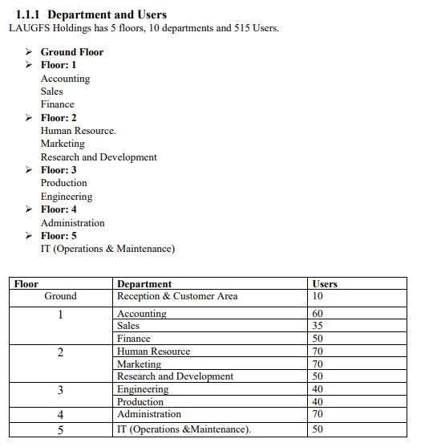
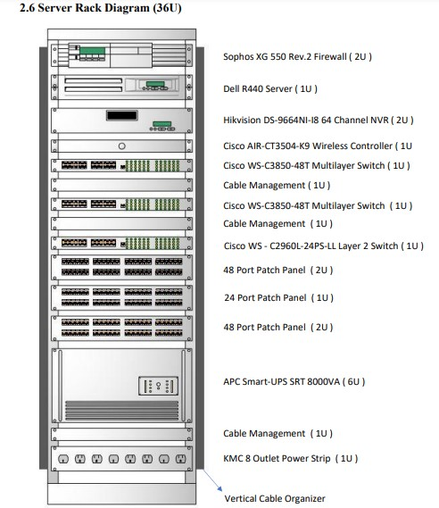

# Designed and Implemented Network

Myself and my colleagues I involved in the 1st year Final Project of our Degree Program, have designed and Implemented a Network Solution for a Virtual Company named Laugf. Which was well-documented and had the above table of contents.

## Requirements
2. Design of Solution
 - 2.1 Network Analysis
 - 2.2 Physical & Logical Network Topologies
 - 2.3 Floor Diagram
 - 2.4 Cabling Diagram
 - 2.5 Access Point Diagram
 - 2.6 Server Rack Diagram (36U)
 - 2.7 Server Room Specifications
 - 2.8 VLAN Table
 - 2.9 IP Address Table
 - 2.10 Switch Port Calculation Table 
 - 2.11 Port Assignment Table
 - 2.12 Protocols Used in the Network 
 - 2.13 ISP Connections
 - 2.14 Bandwidth Calculation
 - 2.15 Limit Bandwidth in Switch Ports
3. Implementation
 - 3.1 Install & Configure the Server
 - 3.2 Implementing AD DS server 
 - 3.2.1 Implementing Group Policies
 - 3.3 Implementing a DHCP server
 - 3.4 Implementing Network Monitoring (SNMP) 
 - 3.5 Implementing Syslog Server
 - 3.6 Implementing Firewall (Sophos XG 550 Rev.2)
 - 3.7 Implementing AAA Server (Cisco ACS)
4. Evaluation
5. Conclusion
6. Appendices
7. References

## Design
 - Topology = Physical Topology | Logical Topology
 
 - Organizational Layout
 
 
 - Server Rack Diagram (36U)
 
 

## Virtually
#### GNS 3

